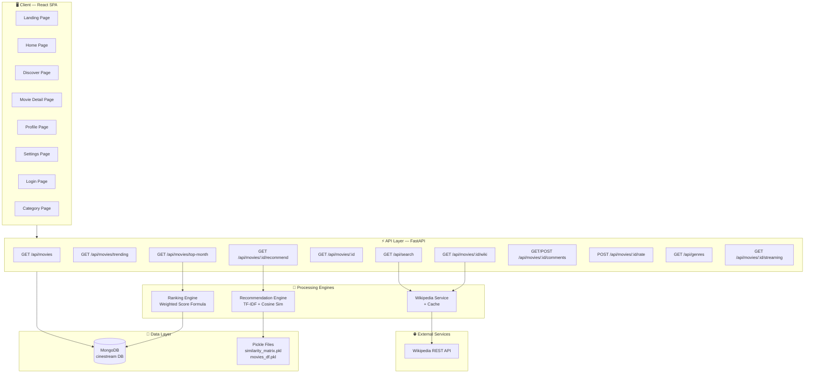
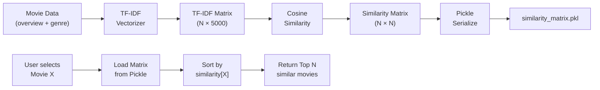
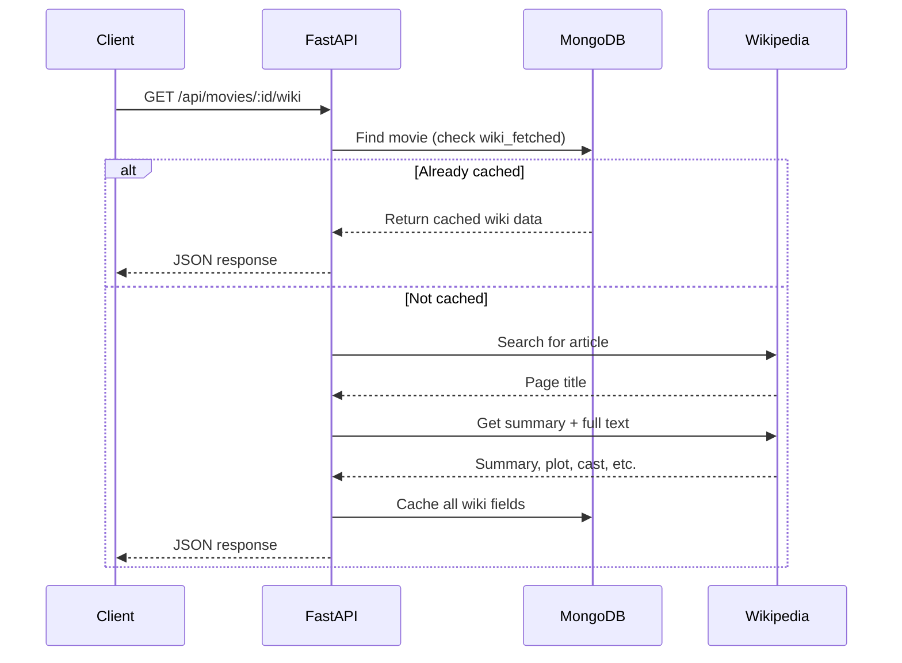
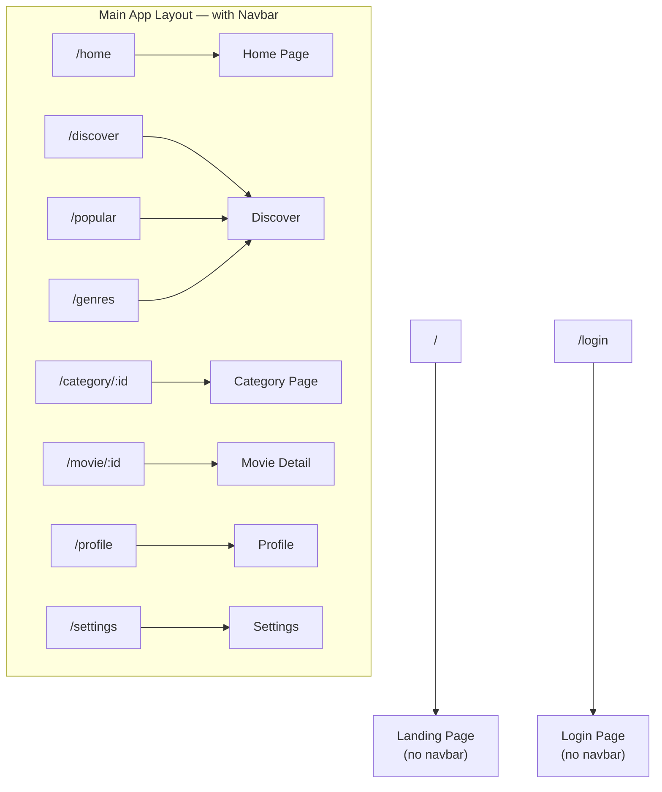
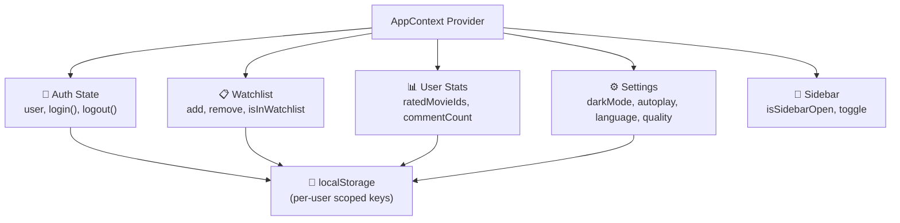
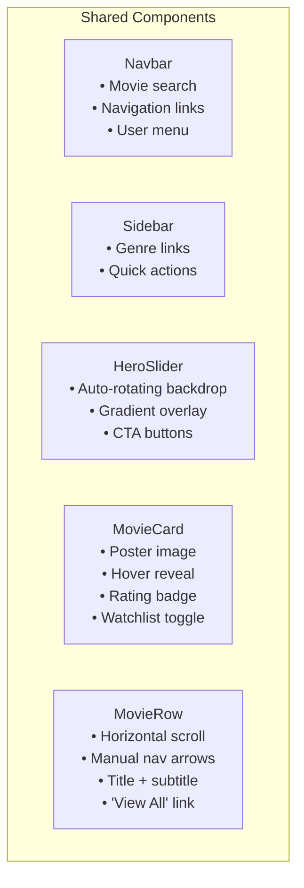
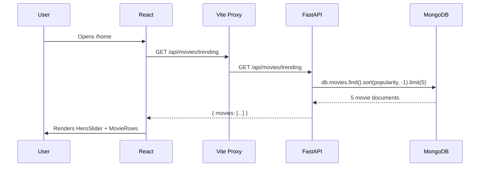
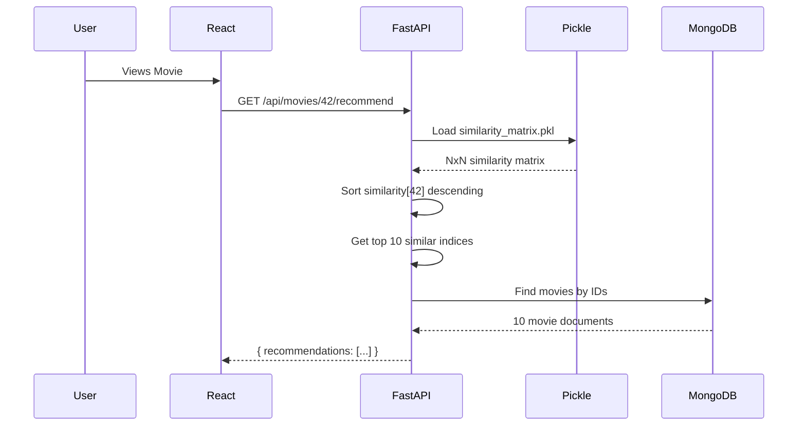
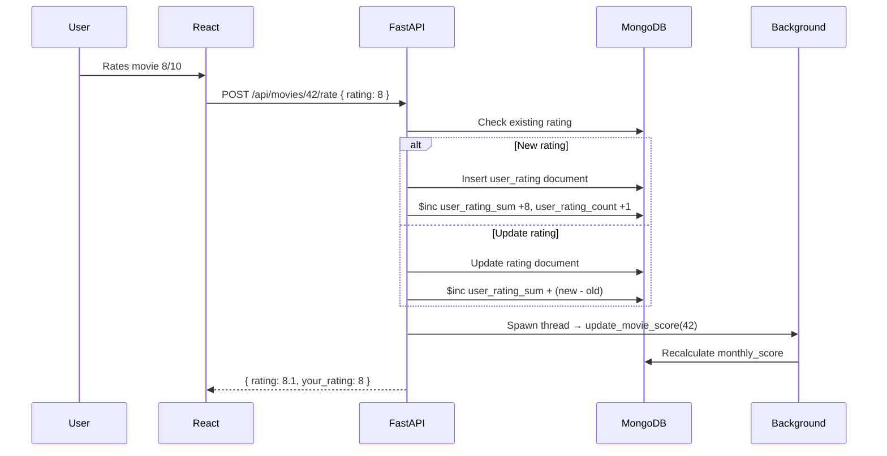
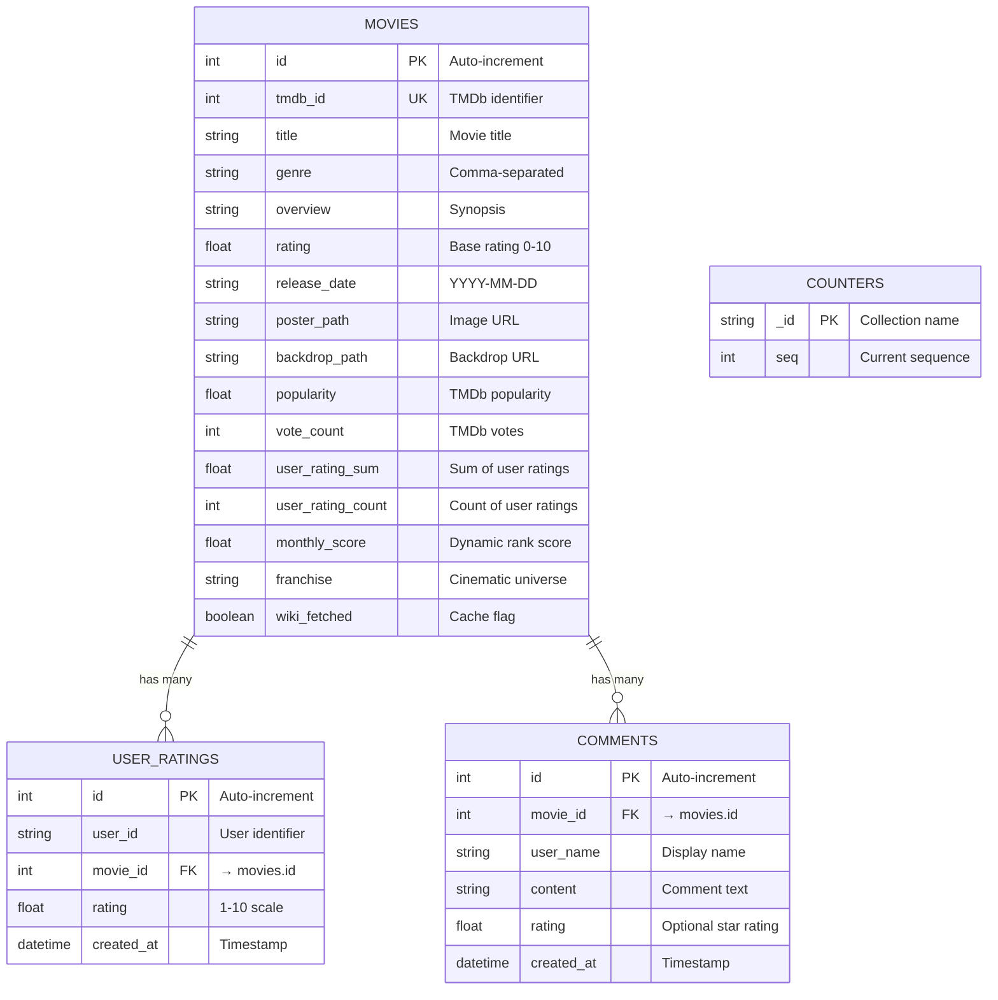

# CineStream — System Design & Architecture

> **A full-stack movie recommendation platform with content-based filtering, Wikipedia-backed enrichment, community reviews, social login, and a premium cinematic UI.**

---

## Table of Contents

1. [Project Overview](#1-project-overview)
2. [High-Level Architecture](#2-high-level-architecture)
3. [Technology Stack](#3-technology-stack)
4. [System Architecture Diagram](#4-system-architecture-diagram)
5. [Backend Architecture](#5-backend-architecture)
   - 5.1 [Directory Structure](#51-directory-structure)
   - 5.2 [Database Layer — MongoDB](#52-database-layer--mongodb)
   - 5.3 [Data Models & Collections](#53-data-models--collections)
   - 5.4 [API Layer — FastAPI](#54-api-layer--fastapi)
   - 5.5 [Recommendation Engine](#55-recommendation-engine)
   - 5.6 [Ranking Engine](#56-ranking-engine)
   - 5.7 [Wikipedia Integration Service](#57-wikipedia-integration-service)
   - 5.8 [Streaming Platform Service](#58-streaming-platform-service)
6. [Frontend Architecture](#6-frontend-architecture)
   - 6.1 [Directory Structure](#61-directory-structure)
   - 6.2 [Routing & Navigation](#62-routing--navigation)
   - 6.3 [State Management — Context API](#63-state-management--context-api)
   - 6.4 [API Client Layer](#64-api-client-layer)
   - 6.5 [Component Architecture](#65-component-architecture)
   - 6.6 [Pages](#66-pages)
7. [Data Flow Diagrams](#7-data-flow-diagrams)
8. [Database Schema](#8-database-schema)
9. [API Reference](#9-api-reference)
10. [Recommendation Algorithm — Deep Dive](#10-recommendation-algorithm--deep-dive)
11. [Dynamic Ranking Algorithm](#11-dynamic-ranking-algorithm)
12. [Metadata Enrichment Notes](#12-metadata-enrichment-notes)
13. [Security & CORS](#13-security--cors)
14. [Deployment Architecture](#14-deployment-architecture)
15. [Future Roadmap](#15-future-roadmap)

---

## 1. Project Overview

**CineStream** is a movie recommendation and discovery platform that combines:

- **Content-Based Filtering** — TF-IDF (Term Frequency – Inverse Document Frequency) + Cosine Similarity for "movies like this"
- **Wikipedia Enrichment** — Automatic fetching of plot, cast, director, budget, and box office
- **MongoDB Atlas Storage** — Cloud-hosted MongoDB used by the backend through PyMongo
- **Community Reviews** — User comments and 1–10 star ratings
- **Social Login + Guest Mode** — Google, Facebook, email/password, and guest preview access
- **Dynamic Rankings** — Monthly scoring algorithm blending popularity, recency, and votes
- **Region-Aware Streaming Links** — Platform links for India, US, UK, and more
- **Premium Cinematic UI** — Netflix-inspired dark theme with glassmorphism and micro-animations

---

## 2. High-Level Architecture

```
┌─────────────────────────────────────────────────────────────┐
│                        CLIENT (Browser)                      │
│  ┌──────────────────────────────────────────────────────┐    │
│  │         React + Vite (SPA)   :5173                   │    │
│  │  ┌──────────┐ ┌──────────┐ ┌──────────┐             │    │
│  │  │  Pages   │ │Components│ │ Context  │             │    │
│  │  │ (8 views)│ │(5 shared)│ │(AppState)│             │    │
│  │  └────┬─────┘ └──────────┘ └──────────┘             │    │
│  │       │                                               │    │
│  │  ┌────▼────────────────────────────────┐             │    │
│  │  │  API Client (Axios) → /api proxy    │             │    │
│  │  └────┬────────────────────────────────┘             │    │
│  └───────┼──────────────────────────────────────────────┘    │
│          │  HTTP (JSON)                                       │
└──────────┼───────────────────────────────────────────────────┘
           │
           ▼  Vite dev proxy → http://localhost:8000
┌──────────────────────────────────────────────────────────────┐
│                     SERVER (Python)                           │
│  ┌────────────────────────────────────────────────────────┐  │
│  │               FastAPI Application   :8000              │  │
│  │  ┌────────────┐ ┌──────────────┐ ┌────────────────┐   │  │
│  │  │  REST API  │ │  Recommend.  │ │  Wiki Service  │   │  │
│  │  │ Endpoints  │ │   Engine     │ │  + Caching     │   │  │
│  │  └─────┬──────┘ └──────┬───────┘ └───────┬────────┘   │  │
│  │        │               │                  │            │  │
│  │  ┌─────▼───────────────▼──────────────────▼────────┐   │  │
│  │  │            PyMongo Driver                       │   │  │
│  │  └─────────────────────┬───────────────────────────┘   │  │
│  └────────────────────────┼───────────────────────────────┘  │
│                           │                                   │
│  ┌────────────────────────▼───────────────────────────────┐  │
│  │        MongoDB Atlas (cloud cluster)                    │  │
│  │  ┌────────┐ ┌────────────┐ ┌────────┐ ┌────────────┐  │  │
│  │  │ movies │ │user_ratings│ │comments│ │  counters  │  │  │
│  │  └────────┘ └────────────┘ └────────┘ └────────────┘  │  │
│  └────────────────────────────────────────────────────────┘  │
│                                                               │
│  ┌────────────────────────────────────────────────────────┐  │
│  │         Pickle Files (./pickles/)                      │  │
│  │  ┌──────────────────┐ ┌────────────────────────────┐   │  │
│  │  │ movies_df.pkl    │ │ similarity_matrix.pkl      │   │  │
│  │  └──────────────────┘ └────────────────────────────┘   │  │
│  └────────────────────────────────────────────────────────┘  │
└──────────────────────────────────────────────────────────────┘
           │
           ▼
   ┌───────────────┐
   │ Wikipedia API │
   │  (REST, free) │
   └───────────────┘
```

---

## 3. Technology Stack

| Layer | Technology | Purpose |
|-------|-----------|---------|
| **Frontend** | React 19 | Component-based UI |
| **Build Tool** | Vite 7 | Fast HMR, dev server with API proxy |
| **Styling** | TailwindCSS 4 | Utility-first CSS framework |
| **HTTP Client** | Axios | Promise-based HTTP for API calls |
| **Routing** | React Router v7 | Client-side SPA routing |
| **Backend** | FastAPI (Python) | Async REST API framework |
| **Database** | MongoDB Atlas | Cloud-hosted NoSQL document store |
| **DB Driver** | PyMongo 4.16 | Official MongoDB Python driver |
| **ML / NLP** | scikit-learn | TF-IDF Vectorizer + Cosine Similarity |
| **Data Processing** | Pandas | DataFrame operations for model building |
| **Serialization** | Pickle | Persist similarity matrix to disk |
| **Authentication** | Google OAuth, Facebook Login, local auth | Sign-in and account linking |
| **External Data** | Wikipedia REST API | Movie details, cast, plot, budget enrichment |

---

## 4. System Architecture Diagram



---

## 5. Backend Architecture

### 5.1 Directory Structure

```
backend/
├── main.py              # FastAPI app — 12+ REST endpoints
├── database.py          # MongoDB connection (PyMongo client)
├── models.py            # Document ↔ Dict converters (Movie, Comment, UserRating)
├── recommendation.py    # TF-IDF + Cosine Similarity engine
├── ranking.py           # Dynamic monthly score calculator
├── seed.py              # Database seeder — 63 curated movies
├── wiki_service.py      # Wikipedia enrichment and streaming helpers
├── requirements.txt     # Python dependencies
└── pickles/
    ├── similarity_matrix.pkl   # Precomputed cosine similarity matrix
    └── movies_df.pkl           # Serialized movies DataFrame
```

### 5.2 Database Layer — MongoDB

**Connection:** `mongodb+srv://...` → Database: `cinestream`

```python
# database.py
from pymongo import MongoClient

client = MongoClient("mongodb+srv://<user>:<password>@<cluster>/cinestream")
db = client["cinestream"]
```

The current project uses **MongoDB Atlas** through the `MONGO_URL` environment variable. MongoDB still uses `ObjectId` natively, but the frontend expects integer IDs, so a `counters` collection implements an atomic auto-increment pattern:

```python
def get_next_id(collection_name: str) -> int:
    result = db.counters.find_one_and_update(
        {"_id": collection_name},
        {"$inc": {"seq": 1}},
        upsert=True,
        return_document=True,
    )
    return result["seq"]
```

### 5.3 Data Models & Collections

#### `movies` Collection

| Field | Type | Description |
|-------|------|-------------|
| `id` | Integer | Auto-increment primary key |
| `tmdb_id` | Integer | TMDb identifier (unique) |
| `title` | String | Movie title |
| `genre` | String | Comma-separated genres |
| `overview` | String | Plot synopsis |
| `rating` | Float | IMDb/TMDb base rating (0-10) |
| `release_date` | String | ISO date (YYYY-MM-DD) |
| `poster_path` | String | TMDb or Wikipedia poster URL |
| `backdrop_path` | String | TMDb backdrop URL |
| `popularity` | Float | TMDb popularity score |
| `vote_count` | Integer | TMDb vote count |
| `user_rating_sum` | Float | Sum of all user ratings |
| `user_rating_count` | Integer | Total user rating count |
| `monthly_score` | Float | Computed dynamic ranking score |
| `franchise` | String | Cinematic universe (e.g., "MCU") |
| `wiki_summary` | String | Wikipedia summary (cached) |
| `wiki_plot` | String | Wikipedia plot section (cached) |
| `wiki_cast` | String/JSON | Cast list from Wikipedia |
| `wiki_director` | String | Director name |
| `wiki_budget` | String | Production budget |
| `wiki_box_office` | String | Box office gross |
| `wiki_runtime` | String | Runtime in minutes |
| `wiki_fetched` | Boolean | Whether wiki data has been cached |

#### `user_ratings` Collection

| Field | Type | Description |
|-------|------|-------------|
| `id` | Integer | Auto-increment primary key |
| `user_id` | String | User identifier |
| `movie_id` | Integer | FK → movies.id |
| `rating` | Float | User rating (1-10) |
| `created_at` | DateTime | Timestamp |

#### `comments` Collection

| Field | Type | Description |
|-------|------|-------------|
| `id` | Integer | Auto-increment primary key |
| `movie_id` | Integer | FK → movies.id |
| `user_name` | String | Display name |
| `user_email` | String | Optional email |
| `content` | String | Comment text |
| `rating` | Float | Optional star rating (1-10) |
| `created_at` | DateTime | Timestamp |

#### `counters` Collection

| Field | Type | Description |
|-------|------|-------------|
| `_id` | String | Collection name (e.g., "movies") |
| `seq` | Integer | Current sequence number |

#### Database Indexes

```javascript
db.movies.createIndex({ "id": 1 }, { unique: true })
db.movies.createIndex({ "tmdb_id": 1 }, { unique: true })
db.movies.createIndex({ "title": 1 })
db.movies.createIndex({ "popularity": -1 })
db.movies.createIndex({ "monthly_score": -1 })
db.movies.createIndex({ "rating": -1 })
db.user_ratings.createIndex({ "movie_id": 1, "user_id": 1 })
db.comments.createIndex({ "movie_id": 1 })
```

### 5.4 API Layer — FastAPI

FastAPI serves as the REST API backend with CORS middleware enabled for cross-origin requests from the React frontend. In the current project it also handles email/password auth, Google login, Facebook login, guest-compatible state, watchlists, ratings, comments, wiki enrichment, and streaming links.

**Startup Lifecycle:**
1. Load pickled recommendation model (similarity matrix + DataFrame)
2. Spawn background thread to recalculate monthly ranking scores
3. Begin accepting HTTP requests

**Request Flow:**
```
Client Request → FastAPI Router → Endpoint Handler → PyMongo Query → MongoDB → Response
```

### 5.5 Recommendation Engine



**Algorithm:**
1. **Feature Engineering:** Combine `overview` + `genre` into a single text field per movie
2. **Vectorization:** TF-IDF with English stop words, max 5,000 features
3. **Similarity:** Cosine similarity between all movie pairs → N×N matrix
4. **Persistence:** Pickle both the similarity matrix and the DataFrame to disk
5. **Inference:** Given movie index, sort the corresponding row descending, return top N

### 5.6 Ranking Engine

The dynamic monthly ranking score blends four factors:

```
Final Score = (0.4 × rating) + (0.3 × popularity) + (0.2 × recency) + (0.1 × votes)
```

| Factor | Weight | Scale | Description |
|--------|--------|-------|-------------|
| **Rating** | 40% | 0–10 | Blended IMDb + user average |
| **Popularity** | 30% | 0–10 | TMDb popularity / 100, capped at 10 |
| **Recency** | 20% | 0–10 | Boost: 10 (≤30d), 8 (≤90d), 5 (≤180d), 2 (≤2y) |
| **Votes** | 10% | 0–10 | Total votes / 500, capped at 10 |

**Execution:** Runs on startup via a background thread. Individual movie scores are recalculated whenever a user submits a rating.

### 5.7 Wikipedia Integration Service



**Data Extracted:**
- Summary (intro paragraph)
- Plot synopsis
- Cast list (top 12)
- Director, budget, box office, runtime
- Cached wiki fields for faster repeated reads
- Genre text when available from stored data or wiki parsing

### 5.8 Streaming Platform Service

Region-aware streaming link generator. Supports:

| Region | Platforms |
|--------|-----------|
| 🇮🇳 India | JioCinema, Netflix, Prime Video, Disney+ Hotstar, Zee5, SonyLIV |
| 🇺🇸 US | Netflix, Prime Video, Disney+, Hulu, HBO Max, Apple TV+ |
| 🇬🇧 UK | Netflix, Prime Video, Disney+, BBC iPlayer, Now TV |
| 🌍 Default | Netflix, Prime Video, Disney+, Apple TV+ |

Links are generated as search URLs pointing to the respective platforms with the movie title encoded in the query.

---

## 6. Frontend Architecture

### 6.1 Directory Structure

```
frontend/src/
├── main.jsx             # React entry point
├── App.jsx              # Router + Layout definitions
├── index.css            # Global styles + CSS custom properties
├── api/
│   └── api.js           # Axios HTTP client (12 API functions)
├── context/
│   └── AppContext.jsx   # Global state (auth, watchlist, guest mode, settings)
├── components/
│   ├── Navbar.jsx       # Top navigation + movie search
│   ├── Sidebar.jsx      # Collapsible side navigation
│   ├── HeroSlider.jsx   # Full-width backdrop carousel
│   ├── MovieCard.jsx    # Movie poster card with hover effects
│   └── MovieRow.jsx     # Horizontal scrollable movie row
├── pages/
│   ├── Landing.jsx      # Marketing landing page
│   ├── Login.jsx        # Authentication page
│   ├── Home.jsx         # Main dashboard with movie rows
│   ├── Discover.jsx     # Browse/filter movies
│   ├── MovieDetail.jsx  # Full movie detail + comments + streaming
│   ├── CategoryPage.jsx # Genre/category filtered view
│   ├── Profile.jsx      # User profile + watchlist
│   └── Settings.jsx     # User preferences
└── assets/              # Static images
```

### 6.2 Routing & Navigation



**Layout Strategy:**
- `/` and `/login` render **without** the Navbar (standalone pages)
- All other routes render **inside** the main layout with the `<Navbar />` component

### 6.3 State Management — Context API



**Key Pattern:** All state is scoped per user via composite localStorage keys:
```
cinestream_{suffix}_{user_email_or_guest}
```

This ensures guest users and logged-in users have separate watchlists, settings, and stats.

### 6.4 API Client Layer

Centralized Axios client with `/api` base URL, proxied through Vite dev server:

```javascript
// vite.config.js
server: {
  proxy: { '/api': 'http://localhost:8000' }
}
```

| Function | Method | Endpoint |
|----------|--------|----------|
| `fetchMovies(params)` | GET | `/api/movies` |
| `fetchTrending()` | GET | `/api/movies/trending` |
| `fetchTopMonth()` | GET | `/api/movies/top-month` |
| `fetchMovie(id)` | GET | `/api/movies/:id` |
| `fetchRecommendations(id)` | GET | `/api/movies/:id/recommend` |
| `searchMovies(query)` | GET | `/api/search` |
| `fetchGenres()` | GET | `/api/genres` |
| `fetchWikiDetails(id)` | GET | `/api/movies/:id/wiki` |
| `fetchComments(id)` | GET | `/api/movies/:id/comments` |
| `postComment(id, data)` | POST | `/api/movies/:id/comments` |
| `rateMovie(id, data)` | POST | `/api/movies/:id/rate` |
| `fetchStreaming(id, country)` | GET | `/api/movies/:id/streaming` |

### 6.5 Component Architecture



### 6.6 Pages

| Page | Description | API Calls |
|------|-------------|-----------|
| **Landing** | Marketing page with hero, features showcase | None |
| **Login** | Email/password + Google + Facebook auth | auth endpoints |
| **Home** | Dashboard: hero slider + 4 movie rows | trending, topMonth, movies (rating), movies (date) |
| **Discover** | Browse all movies with genre filter + sort | movies (paginated), genres |
| **MovieDetail** | Full detail: poster, wiki info, cast, comments, ratings, streaming, recommendations | movie, wiki, comments, recommendations, streaming |
| **CategoryPage** | Category-specific movie grid | movies (filtered) |
| **Profile** | User info, watchlist, stats | None (context-only) |
| **Settings** | Preferences: dark mode, language, quality | None (context-only) |

---

## 7. Data Flow Diagrams

### Movie Discovery Flow



### Recommendation Flow



### Rating & Score Update Flow



---

## 8. Database Schema



---

## 9. API Reference

### Movies

| Method | Endpoint | Query Params | Description |
|--------|----------|-------------|-------------|
| `GET` | `/api/movies` | `page`, `per_page`, `genre`, `sort_by` | Paginated movie list |
| `GET` | `/api/movies/trending` | — | Top 5 by popularity |
| `GET` | `/api/movies/top-month` | — | Top 10 by monthly score |
| `GET` | `/api/movies/{id}` | — | Single movie detail |
| `GET` | `/api/movies/{id}/recommend` | `top_n` | Similar movies (ML) |
| `GET` | `/api/search` | `q` | Search by title (regex) |
| `GET` | `/api/genres` | — | All unique genres |

### Auth and User

| Method | Endpoint | Description |
|--------|----------|-------------|
| `POST` | `/api/auth/signup` | Create an email/password account |
| `POST` | `/api/auth/login` | Login with email/password |
| `POST` | `/api/auth/google` | Login with Google |
| `POST` | `/api/auth/facebook` | Login with Facebook |
| `GET` | `/api/users/{user_id}/state` | Fetch user, watchlist, settings, and stats |
| `PUT` | `/api/users/{user_id}/settings` | Update saved user settings |
| `PUT` | `/api/users/{user_id}/profile` | Update display name and avatar fallback |
| `PUT` | `/api/users/{user_id}/password` | Update local account password |
| `DELETE` | `/api/users/{user_id}` | Delete a user account |
| `POST` | `/api/users/{user_id}/watchlist/{movie_id}` | Add a movie to the watchlist |
| `DELETE` | `/api/users/{user_id}/watchlist/{movie_id}` | Remove a movie from the watchlist |

### Wikipedia

| Method | Endpoint | Description |
|--------|----------|-------------|
| `GET` | `/api/movies/{id}/wiki` | Fetch/cache Wikipedia details |

### Community

| Method | Endpoint | Body | Description |
|--------|----------|------|-------------|
| `GET` | `/api/movies/{id}/comments` | — | Get all comments |
| `POST` | `/api/movies/{id}/comments` | `{user_name, content, rating}` | Post comment |
| `POST` | `/api/movies/{id}/rate` | `{user_id, rating}` | Rate a movie (1-10) |

### Streaming

| Method | Endpoint | Query Params | Description |
|--------|----------|-------------|-------------|
| `GET` | `/api/movies/{id}/streaming` | `country` | Region-aware platform links |

**Special ID Format:**  
The `{id}` parameter supports both integer IDs (`42`) and wiki-prefixed IDs (`wiki:The%20Dark%20Knight`). Wiki IDs auto-create a movie entry in the database with Wikipedia data.

---

## 10. Recommendation Algorithm — Deep Dive

### Phase 1: Model Building (Offline — `seed.py`)

```python
# 1. Combine text features
df["combined"] = df["overview"] + " " + df["genre"]

# 2. Vectorize with TF-IDF
tfidf = TfidfVectorizer(stop_words="english", max_features=5000)
tfidf_matrix = tfidf.fit_transform(df["combined"])
# Shape: (63 movies, 5000 features)

# 3. Compute pairwise similarity
similarity = cosine_similarity(tfidf_matrix)
# Shape: (63, 63) — each cell = similarity score between two movies

# 4. Serialize to disk
pickle.dump(similarity, open("similarity_matrix.pkl", "wb"))
pickle.dump(df, open("movies_df.pkl", "wb"))
```

### Phase 2: Inference (Online — `/api/movies/{id}/recommend`)

```python
# 1. Load precomputed matrix
similarity, df = load_model()

# 2. Find the movie's index in the DataFrame
idx = df[df["id"] == movie_id].index[0]

# 3. Get similarity scores for this movie against all others
scores = list(enumerate(similarity[idx]))

# 4. Sort descending, skip self, take top N
scores = sorted(scores, key=lambda x: x[1], reverse=True)
top_scores = scores[1:top_n+1]

# 5. Map indices back to movie records
return df.iloc[[i[0] for i in top_scores]]
```

### Why TF-IDF + Cosine Similarity?

- **No user history required** — pure content-based, works from day one
- **Interpretable** — similarity is based on shared plot themes and genres
- **Fast inference** — precomputed matrix makes lookups O(N log N) for sorting
- **Low resource** — pickled matrix for 63 movies is ~30KB

---

## 11. Dynamic Ranking Algorithm

```python
def calculate_score(movie) -> float:
    # 1. Base Rating (40% weight)
    rating = movie.rating
    if movie.user_rating_count > 0:
        rating = (rating + user_average) / 2.0  # Blend IMDb + community

    # 2. Popularity (30% weight)
    popularity = min(movie.popularity / 100, 10.0)

    # 3. Recency Boost (20% weight)
    days_old = (now - release_date).days
    recency = 10 if days_old <= 30 else
              8  if days_old <= 90 else
              5  if days_old <= 180 else
              2  if days_old <= 730 else 0

    # 4. Vote Volume (10% weight)
    votes = min(total_votes / 500, 10.0)

    return 0.4*rating + 0.3*popularity + 0.2*recency + 0.1*votes
```

This produces a 0–10 scale score that naturally surfaces:
- **Highly rated** films (The Dark Knight: 7.60)
- **Popular & well-voted** films (Deadpool & Wolverine: 7.48)
- **Recent releases** get a temporary boost that decays over time

---

## 12. Metadata Enrichment Notes

The current project documentation assumes **no Gemini dependency in the active app flow**.

- Movie enrichment is driven by the Wikipedia REST API and local parsing
- Recommendation results come from precomputed TF-IDF pickles, not an LLM
- Genre values are sanitized before they are returned to the frontend so corrupted text does not leak into chips, cards, or filters
- If any Gemini-related code still exists in the repository, treat it as optional or legacy support rather than a required runtime dependency

---

## 13. Security & CORS

| Concern | Implementation |
|---------|---------------|
| **CORS** | `allow_origins=["*"]` — open for development; restrict in production |
| **Auth** | Backend APIs support local, Google, and Facebook sign-in; frontend also keeps per-user local state |
| **Input Validation** | Pydantic models validate all POST request bodies |
| **Rate Limits** | Not implemented — add in production |
| **SQL Injection** | N/A — MongoDB uses parameterized queries natively |
| **XSS** | React auto-escapes rendered content |

---

## 14. Deployment Architecture

### Current: Local Development

```
localhost:5173  (Vite dev server)  ──proxy──▶  localhost:8000  (FastAPI)
                                                      │
                                               MongoDB Atlas  (cloud)
```


**MongoDB configuration:**
Set `MONGO_URL` in the environment:
```python
MONGO_URL = "mongodb+srv://<user>:<pass>@cluster.mongodb.net/cinestream"
```

---

## 15. Future Roadmap

| Feature | Description | Priority |
|---------|-------------|----------|
| **Collaborative Filtering** | User-user similarity for personalized recommendations | High |
| **JWT Authentication** | Secure backend auth with access/refresh tokens | High |
| **MongoDB Atlas Migration** | Already adopted; continue hardening env/config management | High |
| **Rate Limiting** | API rate limiting with Redis or in-memory | Medium |
| **Image Upload** | Custom profile photos and movie poster overrides | Medium |
| **Notifications** | New movie releases, comment replies | Medium |
| **Watch History** | Track what users have watched for better ML | Low |
| **A/B Testing** | Test different ranking formulas and UI layouts | Low |
| **GraphQL API** | Optional GraphQL layer for flexible queries | Low |

---

> **CineStream** — *Curating the finest digital auteur experiences from around the globe.*
