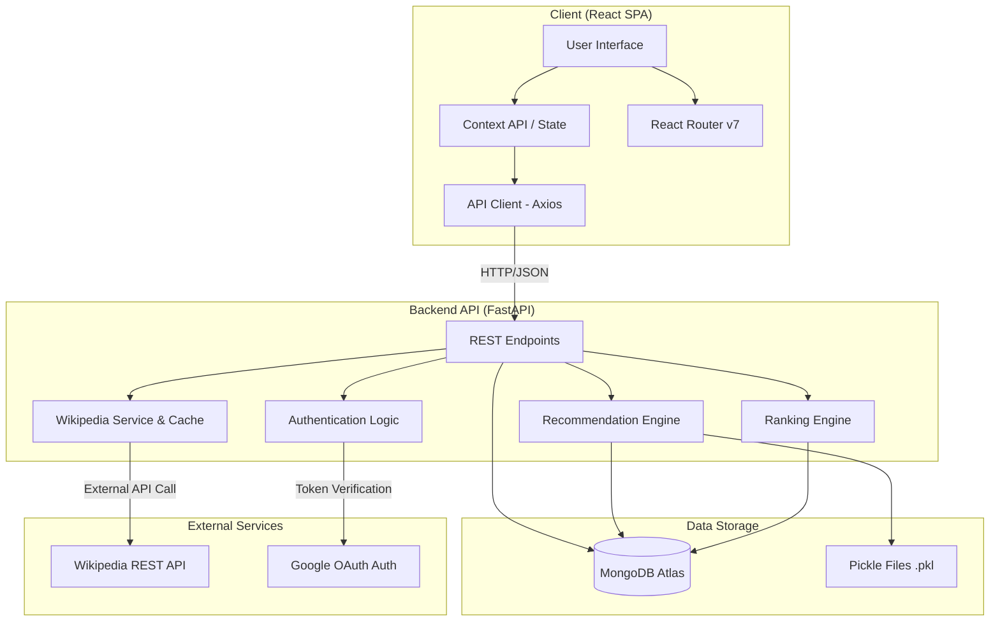
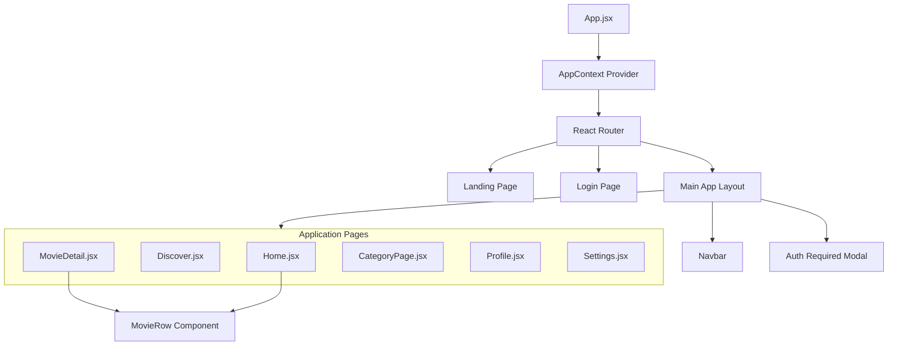
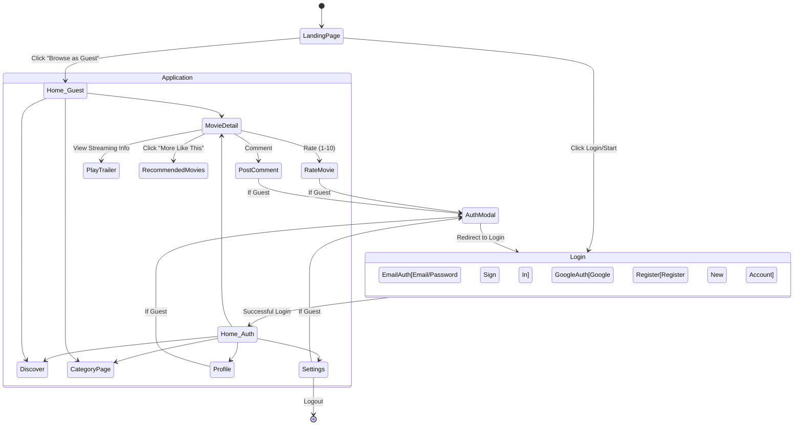

# CineStream: Architecture and User Flow Document

This document provides an updated overview of the High-Level Design (HLD), Low-Level Design (LLD), and the complete User Flow for the **CineStream** project.

---

## 1. High-Level Design (HLD)

The system follows a standard modern web application architecture, decoupling a Single Page Application (SPA) frontend from a RESTful Python API backend, which communicates with a cloud-hosted MongoDB database and external APIs.

### Key Components:
- **Frontend**: A React 19 SPA built with Vite and TailwindCSS 4. It consumes the REST API and provides an interactive cinematic UI.
- **Backend API**: A FastAPI application that provides high-performance asynchronous endpoints for the application.
- **Recommendation Engine**: Uses NLP techniques (TF-IDF Vectorizer + Cosine Similarity) to calculate content-based movie recommendations. The similarity matrix is computed offline/on-startup and saved via `pickle`.
- **Ranking Engine**: Calculates dynamic monthly scores based on popularity, recency, and user ratings to determine trending and top movies.
- **Data Layer**: MongoDB Atlas is used for storing metadata, comments, user profiles, user ratings, and dynamic counters. `PyMongo` connects the backend to the database.

---

## 2. Low-Level Design (LLD)

### 2.1 Frontend Component Hierarchy
The frontend uses `React Router` to navigate between pages and `Context API` to manage global state (e.g., Auth state, Guest mode).

### 2.2 Backend Architecture & Endpoints
The backend modularizes concerns into routes, models, and services.

- **`main.py`**: The application entry point, which wires up CORS and router prefixes.
- **`database.py`**: Manages the PyMongo client connection.
- **`routes/`**: Contains the API routers (`movies.py`, `system.py`, etc.).
- **`models/schemas.py`**: Contains Pydantic models for request validation (e.g., `CommentCreate`, `LoginCreate`, `SettingsUpdate`).
- **`services/`**: Encapsulates external API logic, like `wiki_service.py` for fetching and caching Wikipedia data.
- **`recommendation.py`**: Contains the `get_recommendations` logic interacting with the pre-computed TF-IDF matrix.

### 2.3 Database Schema (MongoDB Collections)
The NoSQL schema utilizes the following primary collections:
1. **`users`**: Stores user credentials, OAuth ids, and settings preferences.
2. **`movies`**: Contains core movie metadata (title, overview, genres, cast).
3. **`comments`**: Stores user comments and reviews on specific movies.
4. **`user_ratings`**: Tracks individual movie ratings per user.
5. **`counters`**: Autoincrement sequence tracker.
6. **`wiki_cache`**: Caches external API responses from Wikipedia to prevent rate limiting.

---

## 4. User Flow

The platform caters to two types of users: **Guest Users** (preview access) and **Authenticated Users** (full access).

### Step-by-Step Flow:
1. **Onboarding**: The user lands on the **Landing Page**, which features a rich hero section. They can choose to sign up, log in with Google, or enter "Guest Mode".
2. **Browsing (Home)**: The user reaches the **Home Page**. This page displays horizontal rows of trending movies, top-rated movies, and category-specific carousels.
3. **Discovery**: Navigating to the **Discover Page** allows the user to explore movies by genre or search. 
4. **Deep Dive (Movie Detail)**: Clicking a movie thumbnail opens the **Movie Detail Page**. Here, the backend automatically augments the movie data with Wikipedia facts (budget, box office, plot). The user sees a list of recommended "Movies like this".
5. **Interaction**: 
   - An authenticated user can rate the movie and leave comments.
   - A guest user clicking these actions will trigger the **Auth Required Modal**, prompting them to log in.
6. **Account Management**: Authenticated users can navigate to **Settings** to modify preferences (like toggling Dark Mode or changing passwords) and view their **Profile**.
